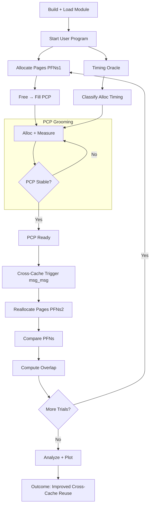

# PCP-LOST
Based on the algorithms in paper titled : Cross-Cache Attacks for the Linux Kernel via PCP Massaging

> [!WARNING]
> This project is a Proof of Concept and it aims to demonstrate the primitive (reliable cross-cache page reuse via PCP manipulation), not a full exploit chain.

## Citation
`Migliorelli, C., Mambretti, A., Sorniotti, A., Zaccaria, V., & Kurmus, A. (2026). Cross-cache attacks for the linux kernel via pcp massaging. In Proceedings of the Network and Distributed System Security Symposium (NDSS). https://www.ndss-symposium.org/ndss-paper/cross-cache-attacks-for-the-linux-kernel-via-pcp-massaging/.`

## Background
<details> 
<summary>Abstract</summary>
Kernel memory allocators remain a critical attack
surface, despite decades of research into memory corruption
defenses. While recent mitigation strategies have diminished the
effectiveness of conventional attack techniques, we show that
robust cross-cache attacks are still feasible and pose a significant
threat. In this paper, we introduce PCPLOST, a cross-cache
memory massaging technique that bypasses mainline mitigations
by carefully using side channels to infer the kernel allocator’s
internal state. We demonstrate that vulnerabilities such as outof-bounds (OOB) — and, via pivoting, use-after-free (UAF) and
double-free (DF) — can be exploited reliably through a crosscache attack, across all generic caches, even in the presence of
noise. We validate the generality and robustness of our approach
by exploiting 6 publicly disclosed CVEs by using PCPLOST,
and discuss possible mitigations. The significant reliability (over
90% in most cases) of our approach in obtaining a cross-cache
layout suggests that current mitigation strategies fail to offer
comprehensive protection against such attacks within the Linux
kernel.
</details>

## Problem Statement (From the Paper)
The NDSS 2026 paper "Cross-Cache Attacks for the Linux Kernel via PCP Massaging" highlights that existing Linux defenses fail to adequately prevent cross-cache memory attacks due to overlooked vulnerabilities in Per-CPU Page (PCP) lists. The research introduces PCPLOST, a technique that leverages PCP list behavior to bypass current mitigations like SLAB_VIRTUAL with over 90% success, enabling reliable cross-cache object allocation. 


## Solution
<details>
<summary>Core Idea</summary>
PCP-LOST introduces a deterministic page-steering primitive by exploiting the behavior of Per-CPU Pagesets (PCP) in the Linux page allocator. The solution is based on three key insights:
  
- PCP as a controllable staging buffer
    - By carefully controlling allocation/free patterns, an attacker can shape the contents and ordering of the PCP freelist.
- Side-channel inference of allocator state
    - This provides a side-channel oracle to infer whether PCP is being used.
- Cross-cache page reuse via controlled draining/refilling
    - By combining PCP manipulation with allocator state inference, the attacker can insert controlled pages into PCP, evict unrelated pages etc.
</details>

## Phases
<details>
<summary>Birdseye View</summary>
  
- Probe and drain the vulnerable cache
- Trigger rmqueue_bulk() to refill the relevant PCP list from free_area
- Spray/fill vulnerable-side pages, placing the vulnerable object at the desired edge
- Probe and drain the target cache
- Trigger target-side allocation from the contiguous buddy page
- Fill the target slab with target objects
- Trigger the OOB/corruption primitive

</details>


## Diagram

## Usage
### 1. Build

```bash
./scripts/build.sh
```

### 2. Run
```bash
./scripts/run.sh
```

### 3. Analyze Results
```bash
cd artifacts
python3 analyze.py
```

### 4. Plot Results
```bash
python3 plot.py
```
